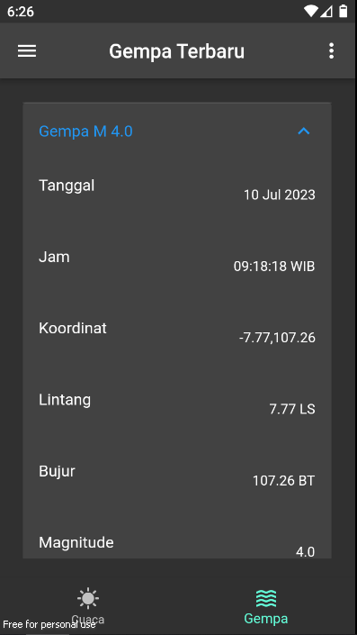

# Info BMKG

Aplikasi untuk menampilkan informasi mengenai cuaca dan gempa yang berasal dari website [Data Terbuka BMKG](https://data.bmkg.go.id/). Aplikasi ini dibuat dengan menggunakan Flutter.

API cuaca yang digunakan berasal dari [Cuaca Gempa REST API](https://github.com/renomureza/cuaca-gempa-rest-api) karena sudah dalam bentuk JSON.

## Fitur

Berikut adalah fitur aplikasi ini:

1. Menampilkan informasi cuaca suatu provinsi atau kota di Indonesia.

